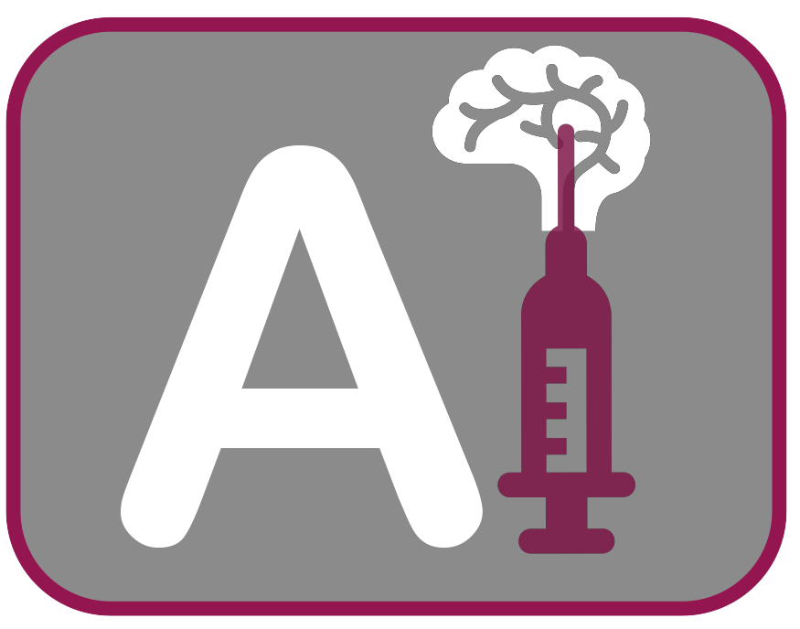

# AI-biopsy

Detect aggressive prostate cancer using MRI images independant of the biopsy.

[](https://www.python.org/downloads/release/python-2715)
[](https://opensource.org/licenses/MIT)



To run the AIbiopsy framework please see the Flowchart.pdf and follow these steps:

1) Install the TensorFlow. Follow the instruction from here: https://www.tensorflow.org/install/

2) Pre-trained Models of CNN architectures should be downloaded from the "Pre-trained Models" part of https://github.com/wenwei202/terngrad/tree/master/slim#pre-trained-models and be located in your machine (e.g. GitHub_AIbiopsy/scripts/slim/run/checkpoint). The files for pre-trained models are available under the column named "Checkpoint".

3) Divide the images with the original size into two or more classes based on the aim of classification (e.g., discrimination of aggressive and non-aggressive prostate cancer). 85% of images in each class will be selected as Train set (train and validation) and 15% for Test set. 

4) _NUM_CLASSES should be set in AIbiopsy.py (this script is located in AIbiopsy/scripts/slim/datasets).

5) Run the convert.py (it is located in the "AIbiopsy/scripts" directory) to allocate the suitable percentage of images to train and validation sets.the convert.py needs three arguments including: the address of images for training, the address of where the result will be located, and the percentage of validation images for the training step: 

```bash
python convert.py ../Images/train process/ 0
```

* Keep the percentage of validation images as 0 because we set 15% for validation inside the code

* It will save converted .tf records in the "process" directory.

6) The Inception-V1 architecture should be run on the Train set images from the "AIbiopsy/scripts/slim" directory. First got the the following directory: AIbiopsy/scripts/slim. Then open load_inception_v1.sh located in "run/" directory and edit PRETRAINED_CHECKPOINT_DIR,TRAIN_DIR, and DATASET_DIR addresses. See the load_inception_v1.sh, for instance. Then, run the following command in shell script: 

```bash
    ./run/load_inception_v1.sh
```

* If you got the bash error like permission denied, run the following line in your shell:

```bash
    chmod 777 load_inception_v1.sh
```


* Each script in slim dataset should be run separately based on the selected architecture. The slim folder contains some sub-folders. 

* You can set up the parameters of each architectures in the run sub-folder. For example you can set the architecture in a way to run from scratch or trained for the last or all layer. Also you can set the batch size or the number of maximum steps. 

* see the result folder at scripts/result as the result of running the above script.

7) The trained algorithms should be tested using test set images. In folder "AIbiopsy/scripts/slim", predict.py loads a trained model on provided images. This code get 5 argu/resultments:

```bash
python predict.py v1 ../result/ ../../Images/test output.txt 2
```

* v1 = inception-v1, ../Images/test = the address of test set images, out.txt = the output result file, 2 = number of classes


